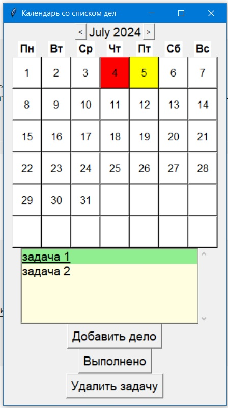

# tkinter_calendar
 календарь со списком дел

Календарь выполнин с применением **tkinter**

Данное приложение позволяет:
+ вбирать месяц
+ выбирать дату в месяце
+ добавлять дело
+ ставить отметку о выполнении дела

Если дело не выполненно, а дата уже прошла,
то день будет подсвечиваться крсным цветом

Дни с назначенными делами подсвечиаются жетым цветом

Вот так выглядит интерфейс программы

